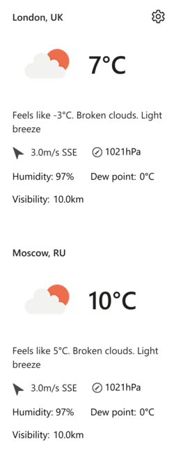
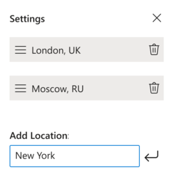

# Weather widget

## Task Requirements
Implement a widget that displays the weather in the specified cities.

**Technologies:** Vue.js, Typescript/ES7 and Babel, SCSS, Webpack.

**Conditions**:

1. Users should be able to add this widget to their websites as simple as inserting the snippet into an HTML-page:
    
   ```
   <weather-widget/>
   <script src="{URL to the app}"></script>
   ```
2. The configured widget should look like this:

    

    The presentation may differ, this is just an example.

3. Get data for the widget from [free public API](https://openweathermap.org/current). You must register an account at OpenWeather.

4. After clicking the ‘Gear’ button at the upper-right corner, switch the view to the following:

    
    
     Here, a user must be able to:
    
     1. Remove previously added cities.
     2. Reorder the cities by dragging and dropping them within the list using ‘Hamburger’ icon to the left from the city name.
     3. Add new locations.
     
     
5. Save the configuration in the local storage and restore it on future visits. A user should be able to configure the widget just once and then have the same view until they change the computer or clean the storage.

6. By default, on initial opening, request the current user’s location and display the weather in their city.

## Live demo
https://weather.aurula.tech

## Usage
```
<weather-widget/>
<script src="https://widgets.aurula.tech/weather.js"></script>
```
